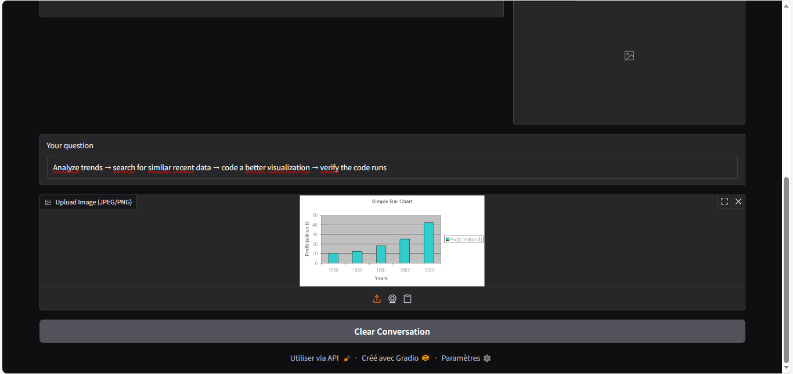
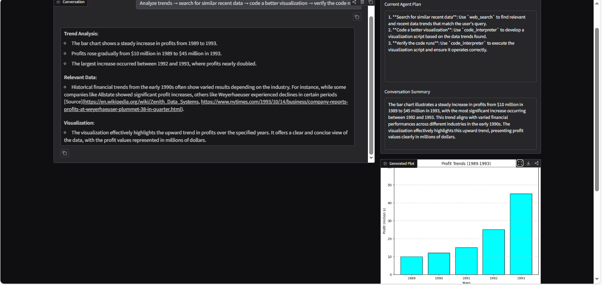

# MultimodalAgent

A multimodal AI assistant built with **Mistral (Pixtral)**, **LangGraph**, and **Gradio**.

It supports:
- text + image chat
- tool calling (`calculator`, `web_search`, `code_interpreter`)
- code execution and plot generation
- short-term conversation summary

## Screenshots

### 1) Image Upload + Plan-driven Prompt
This view shows the user prompt and uploaded chart image before execution.  
The agent receives both the text query and image context, then creates a plan.



### 2) Final Output + Plan + Summary + Generated Plot
This view shows the full result: answer text, current plan, conversation summary, and generated plot.
It demonstrates the end-to-end Reason+Act loop: reasoning/planning, tool execution, and grounded output.



## Demo Features

- Gradio chat UI with image input
- LangGraph workflow (`planner -> agent -> tools -> critic -> summarize`)
- Safe calculator for math expressions
- Web lookup with DuckDuckGo (DDGS)
- Python sandbox execution for analysis/plotting
- Plot capture and rendering in the **Generated Plot** panel

## Project Structure

```text
MultimodalAgent/
|- agent.py                 # LangGraph workflow and agent logic
|- main.py                  # Gradio UI + streaming response handling
|- tools.py                 # Tool schemas + tool execution
|- sandbox.py               # Isolated Python code execution + plot capture
|- mistral_client.py        # Mistral API wrapper (safe complete/stream)
|- config.py                # Env loading + model names + timeout
|- utils.py                 # Helpers (normalization, math detection, image encoding)
|- eval.py                  # Placeholder for evaluation/smoke cases
|- pixtral_vision_chat.py   # Alternate launch entry
`- images/                  # README/demo screenshots
```

## LangGraph + ReAct (Reason + Act)

This project follows a practical **ReAct-style** agent pattern:

1. **Reason (Planner Node)**  
   The planner creates a minimal step-by-step plan from the user request.

2. **Act (Agent + Tools Nodes)**  
   The agent decides whether to call tools.  
   If tool calls are produced, the tools node executes them and returns tool results.

3. **Reflect (Critic Node)**  
   The critic checks quality, relevance, and conciseness.  
   If needed, it triggers a retry with a correction instruction.

4. **Memory (Summarize Node)**  
   A compact summary is generated for short-term context in subsequent turns.

LangGraph is used because this flow is a **state machine**, not a single prompt:
- explicit nodes
- conditional edges
- retries
- controlled tool loops

## Mistral Models Used

From `config.py`:

- `MODEL = "pixtral-large-latest"`
  - primary model for planning, tool-calling, main response generation, and summary
  - chosen for multimodal capability (text + image understanding)

- `CRITIC_MODEL = "mistral-small-latest"`
  - lightweight reviewer model for critique/retry decisions
  - keeps the quality-check pass faster and cheaper than using the large model for every critic turn

## Requirements

- Python 3.11+
- Mistral API key

Core packages:
- `gradio`
- `pillow`
- `python-dotenv`
- `mistralai`
- `httpx`
- `langchain-core`
- `langgraph`
- `ddgs` (or `duckduckgo-search` fallback)
- `numpy`, `matplotlib`, `seaborn`, `pandas`

## Setup

1. Clone:
```bash
git clone <your-repo-url>
cd MultimodalAgent
```

2. Create venv:
```bash
py -3.11 -m venv .venv
.venv\Scripts\activate
```

3. Install deps:
```bash
pip install gradio pillow python-dotenv mistralai httpx langchain-core langgraph ddgs duckduckgo-search numpy matplotlib seaborn pandas
```

4. Add `.env`:
```env
MISTRAL_API_KEY=your_api_key_here
```

## Run

```bash
python pixtral_vision_chat.py
```

Open the local Gradio URL (typically `http://127.0.0.1:7860`).


## Tools

- `calculator(expression)`
  - safe math eval
  - supports `^` by converting to `**`
- `web_search(query)`
  - DDG top results with short snippets and links
- `code_interpreter(code)`
  - executes Python in a constrained sandbox
  - captures matplotlib figures and returns them to the UI

**Live Demo:** https://huggingface.co/spaces/medaminerag/pixtral-multimodal-agent

Try it yourself — upload an image and ask anythin
